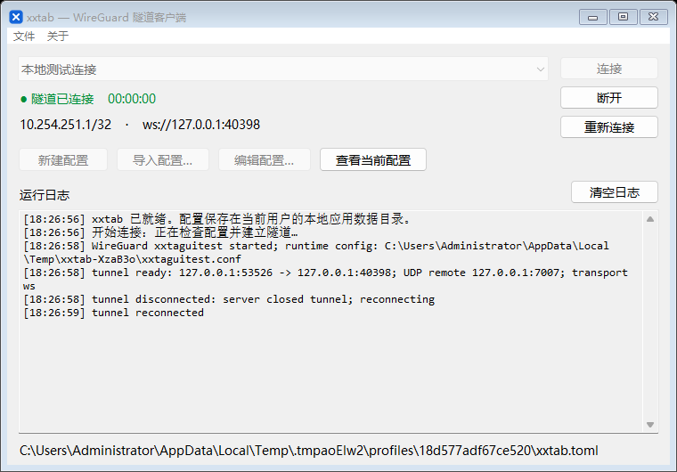
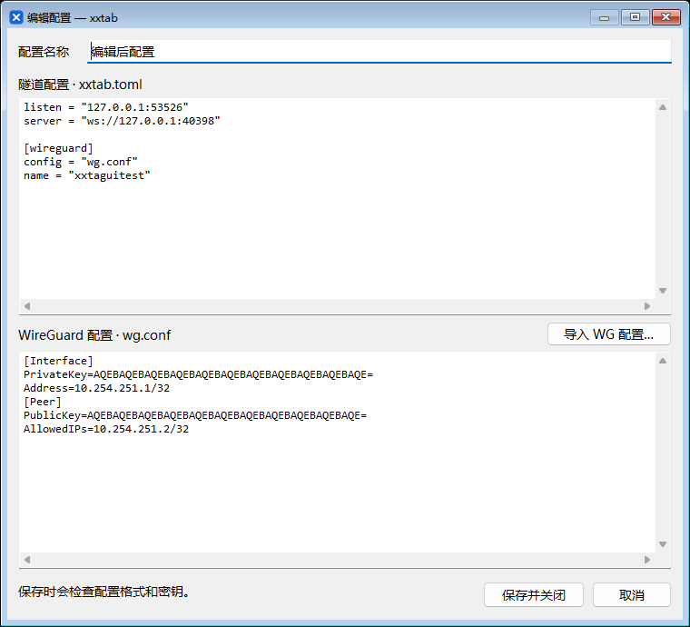

# xxtab

轻量 Rust 客户端，将 **系统 WireGuard + 内置 wstunnel WebSocket 传输**统一管理，支持 Windows / Linux / macOS。

```text
应用流量 → 系统 WireGuard → 127.0.0.1:51820/UDP
                           ↓ xxtab 内置 WS/WSS
                     官方 wstunnel server
                           ↓ UDP
                       WireGuard 服务端
```

WireGuard 加密由专用 WireGuard 实现执行；xxtab 不解密 VPN 报文。客户端不用另起 wstunnel-cli 进程，也不包含浏览器或连接池。Windows 提供独立的轻量原生界面 `xxtab-gui.exe`，界面与转发核心在同一个进程内运行，使用系统 WireGuard；macOS App 内置 wireguard-go、wg、wg-quick 和 Bash，用户无需安装 Homebrew。当前兼容性基线为官方 **wstunnel v10.7.1 的默认 WebSocket 模式**。

## Windows 可视化界面

Windows 安装包位于 `dist/installers/xxtab-0.1.3-windows-x64-setup.exe`，支持 Windows 10 1809+ / Windows 11 x64。中文向导会安装界面和命令行程序、创建快捷方式；本机缺少 WireGuard 时从包内安装官方版本，已有版本保留。卸载保留用户配置和系统 WireGuard。安装包中的程序静态链接 C 运行库，无需另装 Visual C++ 运行库。打包及验证方法见 [Windows 安装包说明](docs/windows-installer.md)。

直接双击 `dist/windows-x64/xxtab-gui.exe`。系统会要求管理员权限，用于启停 WireGuard 和维护路由；不需要额外运行命令行客户端。



- **导入配置**：选择现有 `xxtab.toml`（连同它引用的 WireGuard 配置读取），或者直接导入 WireGuard `.conf`。导入 WG 文件后，需要在上方编辑区填写 wstunnel 服务器信息。
- **新建／编辑配置**：在独立窗口中分别编写隧道 TOML 与 WireGuard 配置；支持配置名称、导入 WG 文件和保存前校验。
- **查看当前配置**：以只读方式查看、选择和复制当前选中的已保存配置，连接期间也可以使用。
- **检查更新**：菜单按需检查 GitHub Releases，下载对应平台包并校验 SHA256；确认后断开连接并打开安装向导，保留配置。macOS 使用应用菜单中的同名入口，Linux 使用 `xxtab update check` / `xxtab update download`。详见 [程序更新](docs/updating.md)。
- **连接／断开／重新连接**：连接过程在后台线程执行；连接时锁定配置选择与编辑。重新连接会先完成清理再启动；关闭主窗口也会先断开并清理。
- **系统托盘**：最小化后隐藏到托盘，隧道继续运行；点击托盘图标恢复窗口。右键菜单提供“连接、断开、重新连接、退出”，按当前状态启用操作；退出会先断开并清理接口与路由。资源管理器重启后自动恢复托盘图标。
- **状态和日志**：显示隧道状态、连接时长、配置地址，以及底部实时日志；支持选择复制和清空日志。日志历史与待显示队列都有上限。

界面中的“隧道已连接”表示外层 WebSocket 和本地 WireGuard 接口已就绪，不代表已经验证远端 WireGuard 握手或互联网可达性。实际连接错误、自动重连和清理结果均在日志中显示。

GUI 配置保存在 `%LOCALAPPDATA%\xxtab\profiles`，导入的原始文件不会修改。每次保存先写入完整的双文件配置，再原子更新配置列表；历史版本保留在该目录供手工恢复。使用私有 CA 时，界面编辑中的 `ca_file` 需为绝对路径；导入 TOML 时自动转换其相对 CA 路径。该目录包含 WireGuard 私钥，不要公开分享。

本机 Windows x64 GUI 空闲时工作集约 **11.6 MiB**、私有提交约 **1.9 MiB**。这是主窗口打开、尚未连接时的短时测量，不是连接后的总内存或长期峰值。



macOS 提供原生 AppKit 界面和菜单栏控制，支持 Apple Silicon / Intel。安装、权限与打包见 [macOS 使用说明](docs/macos.md)。Linux 继续使用命令行，不构建或依赖图形界面。

GitHub Actions 仅在推送 `v*` 版本标签时构建，普通分支 push 和 PR 不触发。标签必须与 Cargo.toml 版本一致，例如 `git push origin v0.1.3`；Windows、两种架构的 macOS 和 Linux 全部构建成功后自动发布 GitHub Release，供客户端检查更新。下载方法见 [CI 自动打包说明](docs/ci.md)。安装包仅包含运行组件和许可文件。

## 快速开始

### 1. 准备服务端

服务端应已有可用的 WireGuard 接口，例如 UDP `7007`，并配置好转发、防火墙及 NAT。再运行官方 wstunnel：

```bash
wstunnel server \
  --restrict-to 127.0.0.1:7007 \
  --restrict-http-upgrade-path-prefix YOUR_LONG_RANDOM_SECRET \
  --tls-certificate /etc/letsencrypt/live/vpn.example.com/fullchain.pem \
  --tls-private-key /etc/letsencrypt/live/vpn.example.com/privkey.pem \
  wss://0.0.0.0:443
```

客户端 `remote` 要与 `--restrict-to` 一致；`127.0.0.1` 指 **wstunnel 服务端所在主机**。如果两个服务端不在同机，改为 WireGuard 服务端的可达地址。服务器只需对客户端开放外层 TCP 端口。

使用有效的域名证书；私有 CA 可通过客户端 `ca_file` 加载。不支持跳过证书校验，官方内置自签名证书不能直接使用。WebSocket 掩码配置保持官方默认，不要给服务端添加 `--websocket-mask-frame`。部分严格要求 RFC 掩码的反向代理不兼容此模式。

### 2. 准备客户端配置

复制 `examples/xxtab.toml` 为自己的 `xxtab.toml`，将现有 WireGuard 配置保存为同目录的 `wg.conf`，或从 `examples/wg.conf.example` 填写。不要把真实私钥提交到版本库。

```toml
server = "wss://vpn.example.com:443"
# 可选，指定实际 IPv4；TLS 仍验证上面的域名。
# server_ip = "203.0.113.10"
path_prefix = "YOUR_LONG_RANDOM_SECRET"
remote = "127.0.0.1:7007"
listen = "127.0.0.1:51820"
# ca_file = "ca.pem"

[wireguard]
config = "wg.conf"
name = "xxtab0"
mtu = 1280
```

`config`、`ca_file` 相对于 TOML 所在目录解析。`name` 是本程序管理的接口／服务名称，不能与已存在的 WireGuard 接口重名。程序不会修改原始 `wg.conf`，而是创建受权限保护的临时配置，将 Endpoint 替换为本地 UDP 监听地址。

### 3. 启动

Windows：先安装官方 [WireGuard for Windows](https://www.wireguard.com/install/)，在管理员 PowerShell 中执行：

```powershell
.\xxtab.exe check .\xxtab.toml
.\xxtab.exe run .\xxtab.toml
```

默认调用 `C:\Program Files\WireGuard\wireguard.exe`，非标准路径可配置 `wireguard.executable`。不必预先在 WireGuard GUI 中导入或启动同一份配置。

Linux：需要内核 WireGuard、`wireguard-tools`、`iproute2`、Bash；配置 DNS 时还需与 `wg-quick` 兼容的 `resolvconf`。

```bash
chmod 600 xxtab.toml wg.conf
./xxtab check ./xxtab.toml
sudo ./xxtab run ./xxtab.toml
```

程序先建立外层连接，再添加服务端 IPv4 `/32` 绕行路由并启动 WireGuard。随后持续转发，断线自动重连。Ctrl+C 退出时先停 WireGuard，再删除本程序添加的绕行路由和临时配置；Linux 同时处理 SIGTERM。系统命令超时或启动失败也会尝试回滚。

`relay` 子命令仅运行传输层，供调试或已有 WireGuard 管理方式使用：

```bash
./xxtab relay ./xxtab.toml
```

这个模式不处理系统接口、路由或 DNS，并将第一个本地 UDP 来源固定为返回地址；启动前保证本地端口仅由预期客户端使用。托管 `run` 模式则固定为生成的 WireGuard ListenPort。

## 内存与延迟设计

0.1.1 增加可选 `interactive` 模式和链路健康日志，针对慢代理下的小请求排队。Cloudflare/CDN + nginx 用户可按 [链路延迟排查与配置](docs/cdn-latency.md) 对比；默认仍为 `balanced`，已有用户配置需主动选择低延迟模式。该模式无法消除 CDN 绕路及服务端发送排队，高 RTT 的 Windows 批量吞吐可能下降。

- 单线程 Tokio 事件循环；不按 CPU 数量建立工作线程，不按数据包创建任务。DNS／Windows 运行库仍可能产生辅助线程。
- 一条持续的 TCP/WebSocket 连接，启用 TCP_NODELAY，每个 WebSocket 二进制帧对应一个 UDP 报文。
- 复用 33 个、每个容量 2048 字节的发送缓冲，覆盖 32 包队列和一个正在写入的包；稳定转发时不再为每个本地 UDP 包申请／释放堆内存。队列通过单线程内部状态共享，移除了来源地址和接收时间上的互斥锁。
- 只合批当前已排队的数据，每批最多 16 帧，共用一个 16 KiB 写缓冲后刷新 TLS；单包立即刷新，不等待凑批。每处理一批主动让其他收发任务运行，减少突发接收挤满队列的机会。
- 排队载荷上限仍为 64 KiB；复用池载荷容量约 66 KiB，另有 16 KiB 写缓冲，以及协议、TLS 和操作系统缓冲。这是减少分配次数、限制内存增长的优化，不保证进程工作集低于旧版本。
- 排队超过 100 ms 的包丢弃（原为 250 ms）；连接中断期间直接丢包，避免恢复后发送大量过时报文。已经交给 TCP 的字节无法撤回。
- 出现应用队列拥塞时，日志每 5 秒汇总一次 `transport congestion: queue full=... expired=...`。前者表示队列已满，后者表示排队过期；这些计数不包含操作系统、服务端或公网中的丢包。没有拥塞时不输出这类日志。
- 15 秒心跳、45 秒无接收判定故障、10 秒连接／写入超时；重连从 1 秒退避到最多约 30 秒并带少量随机延迟。
- 默认 MTU 1280，可调整到 1420；自动设置 PersistentKeepalive 25 秒。
- release 使用 LTO、单 codegen unit 和符号剥离。

**不能保证任何网络下都不卡。** WebSocket 基于 TCP，外层丢包会造成队头阻塞，内层 TCP 流量也会受到影响。在允许原生 UDP 的网络，直接 WireGuard 通常具有更低延迟。这里的内存上限设计只限制应用队列，不是整个进程或操作系统的总内存承诺。

0.1.0 Windows x64 命令行 `xxtab.exe` 非静态 CRT release 的历史回显测试：程序约 **2.29 MiB**；WS 工作集约 **5.94 MiB**，WSS 约 **6.47 MiB**；进程私有提交约 **1.2 MiB**。这是优化版本单个命令行进程的短时测量，不包含 GUI、WireGuard 服务、驱动和内核网络缓冲，也不是长期内存峰值。GUI `xxtab-gui.exe` 约 **2.40 MiB**，运行内存还包括原生控件和日志显示。1000 个不同大小的回显报文逐字节验证通过；本机延迟不能代表公网表现。

优化版本的重复负载测试、内存实测及仍存在的大突发丢包见 [性能测试记录](docs/performance.md)。默认 MTU 保持 1280；它优先考虑较复杂链路的兼容性。网络稳定且确认路径支持时，可以在配置的 `[wireguard]` 下试用 `mtu = 1380` 或 `1420`，再对比实际下载和延迟；程序不会自动修改现有配置。

## 当前边界

- 一个 WireGuard 接口、一个 Peer、一个服务端目标；外层目前只支持 IPv4。VPN 内层支持 IPv4/IPv6。
- 只实现 WS/WSS UDP 转发；不支持 HTTP/2、QUIC、SOCKS、HTTP CONNECT 代理、mTLS 和多节点切换。
- 启动时只解析并固定一个服务端 IPv4；运行期间不更新 DNS。服务器 IP、网关或物理网络改变后，退出并重新启动。
- 支持标准 Interface 字段 PrivateKey、Address、DNS（仅 IP）、ListenPort、MTU，以及 Peer 字段 PublicKey、PresharedKey、AllowedIPs、Endpoint、PersistentKeepalive。MTU、Endpoint、Keepalive 由 xxtab 生成；未指定 ListenPort 时选择空闲端口，若启动时被抢占则报错回滚。
- 拒绝多 Peer、重复字段、PostUp/PreUp/PostDown/PreDown、SaveConfig、自定义 Table/FwMark，避免执行导入配置中的命令或破坏路由管理。
- 全局 `0.0.0.0/0`、`::/0` 会转换为两条 `/1`，避免 Windows WireGuard 的严格防火墙阻断外层 TCP。这提供全流量路由，**不提供 Kill Switch**。已有更具体的系统路由仍优先；IPv6 是否通过隧道取决于 AllowedIPs 和服务端能力，未覆盖的流量可能走原网络。
- Ctrl+C / SIGTERM 可正常清理；强制结束、断电或进程崩溃无法保证清理。程序为前台管理器，不是 Windows 服务包装器，也未实现崩溃后自动恢复。

异常退出后先手工停托管接口，确认后清理日志中记录的临时目录及本程序添加的服务器 `/32` 路由。Windows：`wireguard.exe /uninstalltunnelservice xxtab0`；Linux：`wg-quick down /日志中的临时目录/xxtab0.conf`。只删除确认属于本次运行的路由，不要删除原有系统路由。清理失败时程序保留临时配置并输出位置，供手工恢复。原始私钥文件的权限由使用者管理。

## 构建与验证

Rust 1.89+，建议使用项目已测试的 Rust 1.92。Linux GNU 产物依赖构建环境对应的 glibc；需要兼容旧发行版时在目标发行版构建，或自行使用 musl 工具链。

本次附带的 Linux x64 二进制需要 **glibc 2.39+**（例如 Ubuntu 24.04 / Debian 13）；Windows 附带 x64 可执行文件。可在 `dist` 目录找到二进制、配置示例和 SHA256 校验文件。

```bash
cargo build --release --locked
cargo test --locked
cargo clippy --all-targets -- -D warnings
```

在 Windows MSVC 工具链下同时生成界面版本：

```powershell
cargo build --release --locked --features windows-gui
cargo test --features windows-gui --all-targets
cargo clippy --features windows-gui --all-targets -- -D warnings
```

GUI 的原生控件测试会启动测试窗口和真实 WireGuard 服务，验证连接、重连、断开、编辑保存、控件禁用状态和关窗清理；需要管理员权限、官方 wstunnel，且只操作临时测试配置：

```powershell
$env:WSTUNNEL_BIN = 'C:\tools\wstunnel.exe'
cargo test --features windows-gui --bin xxtab-gui -- --ignored --nocapture
```

真实互通测试需要官方 wstunnel v10.7.1 和 PATH 中的 OpenSSL；它们仅用于测试，客户端运行不依赖这两个可执行文件。

```powershell
$env:WSTUNNEL_BIN = 'C:\tools\wstunnel.exe'
$env:XXTAB_BIN = (Resolve-Path .\target\release\xxtab.exe).Path
cargo test --test interop -- --ignored --nocapture --test-threads=1
```

```bash
WSTUNNEL_BIN=/path/to/wstunnel cargo test --test interop -- --ignored --nocapture --test-threads=1
```

测试覆盖 WS/WSS 报文完整性、边界大小、超大 UDP、来源固定、心跳、服务端重启后的重连、不可信证书拒绝、日志不泄露路径密钥。`system::tests` 中的忽略测试需要管理员/root 和系统 WireGuard，会创建并删除测试接口 `xxtabtest` 和文档地址 `198.51.100.42/32` 的临时路由，需手工选择执行。

Windows 与 Debian/WSL2 的上述测试均已实际通过。Linux 另外使用 `tests/e2e_linux.py` 在独立 network namespace 内验证了真实 WireGuard 握手、完整加密链路的 ICMP 通信，以及 SIGTERM 后的接口和绕行路由清理；测试不修改默认路由和 DNS。真实公网吞吐、丢包场景和长时间运行峰值仍需用实际部署环境验证。

```bash
cargo test system::tests -- --ignored --nocapture --test-threads=1
```

协议参考：[wstunnel v10.7.1](https://github.com/erebe/wstunnel/tree/v10.7.1)。本项目只实现所需兼容协议，并使用公开 Rust 库；未把完整 wstunnel 服务端或 CLI 编译到客户端中。


win运行命令：cargo run --release --features windows-gui --bin xxtab-gui
win打包命令  .\tools\build-installer.ps1
